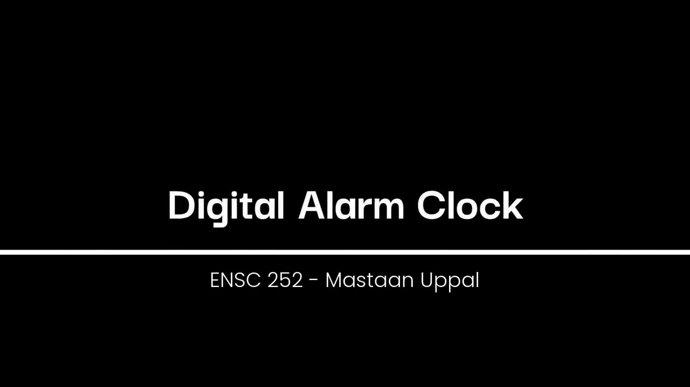

# Digital Alarm Clock — VHDL on a Cyclone V FPGA

**ENSC 252 final project (SFU)** · Mastaan Uppal

A 24-hour digital alarm clock written entirely in VHDL and demonstrated on a Terasic **DE10-Standard** board (Intel Cyclone V).

### ▶ [Watch the demo video](https://mastaanuppal-dotcom.github.io/Portfolio/alarm-clock/)

## Controls

| Input | Function |
|---|---|
| KEY0 | Hard reset — time to 12:00:00, alarm to 00:00:00 |
| KEY1 | Cycle mode: display time → set time → set alarm |
| KEY2 | Cycle edit field: seconds → minutes → hours |
| KEY3 | Increment the selected field |
| SW8 | Alarm stop (soft reset — clears an active alarm only) |
| SW9 | Fast demo mode — time runs 100× faster |

**Outputs:** HEX5–HEX4 hours, HEX3–HEX2 minutes, HEX1–HEX0 seconds · LEDR0–2 one-hot mode · LEDR3–5 one-hot edit field · LEDR8–9 flash while the alarm is active.

## Design

| File | Description |
|---|---|
| `AlarmClock.vhd` | Top level — structural wiring of all blocks to the DE10-Standard I/O |
| `PreScale.vhd` | Divides the 50 MHz clock to a 1 Hz tick (or 100 Hz in demo mode) plus a 4 Hz blink signal |
| `BCDCounter.vhd` | Two-digit BCD modulo counter (mod 60 / mod 24) with rollover carry for chaining |
| `ClockFSM.vhd` | One-hot control FSM for mode and edit field, with safe recovery from invalid states |
| `AlarmControl.vhd` | Latches the alarm when time first matches the alarm register; cleared by the stop switch |
| `Debounce.vhd` | Two-flop synchronizer + 10 ms debouncer for the push buttons and switches |
| `EdgeDetect.vhd` | Turns a debounced press into a single-cycle pulse |
| `Test*.vhd` | Testbenches for the top level, counter, FSM and debouncer |

## Tools

VHDL-2008 · Quartus Prime · ModelSim · GHDL · SignalTap · DE10-Standard (Cyclone V 5CSXFC6D6F31C6)
